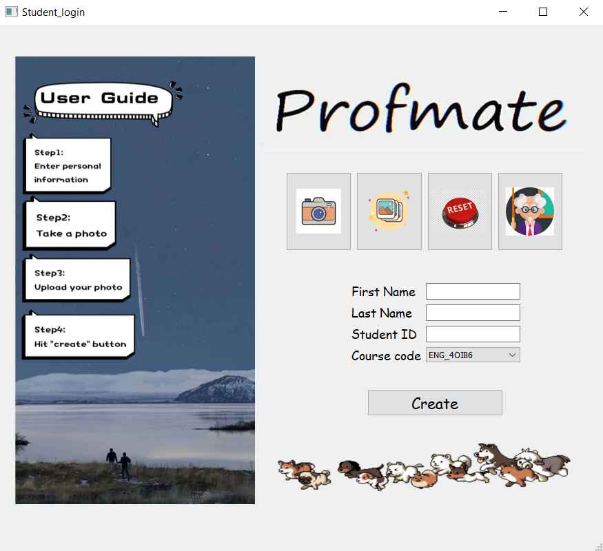
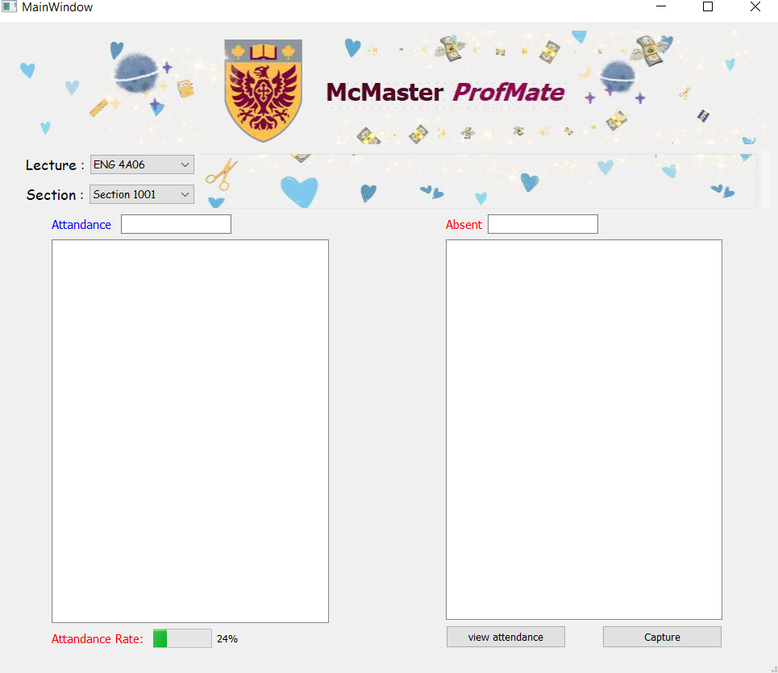

# Please read this file to run the module

This is the capstone project for 2020 Winter term Mcmaster University. Copyrights by team ProfMate.

Team members: Zhen Gong, Tianyi Li, Mingxuan Hao, Qixuan Tong

Description: The purpose of the project is to develop a device that allows to take class attendance automatically based on face recognition. It aims to provide easy ways to collect and report the attendance data to the professor.  

The entire project includes :
* a camera module (Raspberry Pi)
* an API cloud service (Face++)
* Database (mysql)
* User Interface (python)

You may not be able to run the full project, however you can run the User Interface.

This is an example of the user interfaces. It includes: 
* a registration page for students to create personal profile
* a professor page to view list of attendance
  
You can either run main.py or student.py on your compiler to start the program.

Preview: Registration page

Preview: Professor's Page
